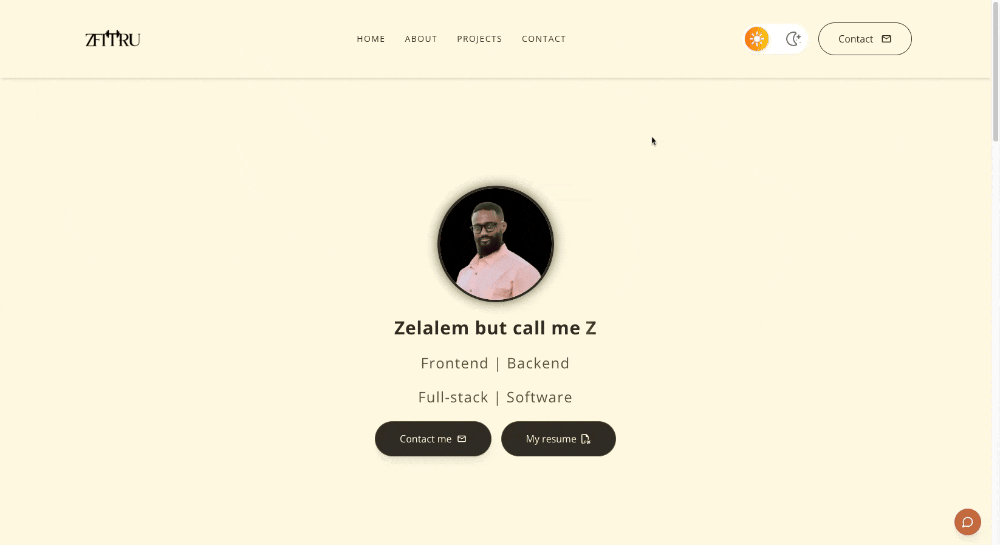

# Z's Developer Portfolio 

Welcome to my personal portfolio, a space where I showcase my journey from U.S. Army to Software Developer. 
This site highlights the projects I've built, the technologies I use, and the skills I bring.

## Features 
- Projects, background, and resume all in one place.
- Smooth and responsive UI built with Tailwind CSS.
- Mobile friendly design. 
- Interactive chatbot to answer some questions about me.

## Preview 



## Tech Stack 
- **Framework:** Next.js
- **Styling:** Tailwind CSS
- **Icons:** Lucide React
- **Deployment:** Vercel

## Getting Started 

If you want to clone this repo and run it locally:

```bash
git clone git@github.com:ZTFitru/zplusfitru.git
cd into what you cloned down
npm install
npm run dev
visit localhost:3000
